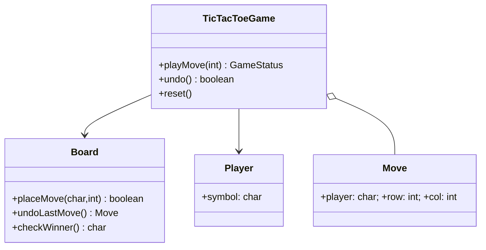

# StandardTicTacToe Reference Implementation

This folder contains a clean, small reference implementation of Tic Tac Toe designed for LLD practice.

Files:
- `Board.java` — board state, validation, winner detection, undo history
- `Move.java` — move value object
- `Player.java` — player symbol and score
- `TicTacToeGame.java` — orchestration (no I/O)
- `Main.java` — runnable demo (non-interactive)

UML (quick mermaid):



Short notes for revision:
- Separate UI and logic: `TicTacToeGame` + `Board` contain all rules.
- Validate inputs in `Board` and return clear status from `TicTacToeGame`.
- Keep history in `Board` for `undo()`; do not let UI mutate board directly.
- Test: row/column/diagonal wins, draw, invalid moves, undo.

To compile and run demo from project root:

```bash
javac StandardTicTacToe/*.java
java StandardTicTacToe.Main
```

Notes: This demo is non-interactive so you can run it in CI or quickly verify behavior.
